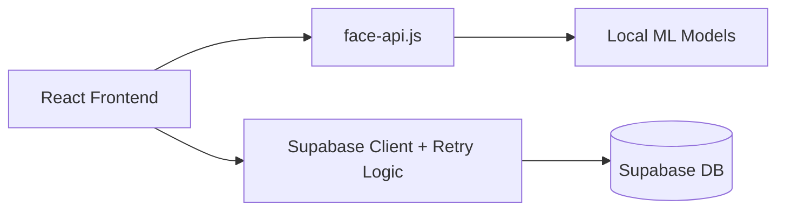

# 🔐 School Biometric Access Control System

A modern, fast, and secure facial recognition-based biometric access control system for schools. Built with React, face-api.js, and Supabase.


## ✨ Features

- **🎯 Fast Recognition**: Optimized face-api.js settings for rapid detection.
- **📸 Real-time Capture**: Live camera feed with biometric oval guide for perfect positioning.
- **👥 Multi-Role Management**: Track students, lecturers, staff, and visitors seamlessly.
- **🔒 Resilient Data Fetching**: Smart retry logic with exponential backoff for stable production connectivity.
- **📊 Advanced Dashboard**: Real-time stats, access logs, and administrative controls.
- **⚡ Continuous Mode**: Automatic background scanning for entrance points.
- **📱 Responsive UI**: Premium glassmorphism design fully optimized for mobile and desktop.

## 🏗️ Architecture



## 📋 Prerequisites

- Node.js (v18+)
- Supabase Project
- Modern browser with Camera/Webcam access
- Vercel or similar for production hosting (HTTPS required)

## 🚀 Deployment & Setup

### 1. Environment Configuration
Create a `.env` file in the root:
```env
VITE_SUPABASE_URL=your_project_url
VITE_SUPABASE_ANON_KEY=your_anon_key
```

### 2. Database Initialization
Run the contents of [database-schema.sql](file:///C:/Users/PC/.gemini/antigravity/scratch/school-biometric-system/database-schema.sql) in your Supabase SQL Editor. This sets up required tables and RLS policies.

### 3. Face AI Models [CRITICAL]
The system requires specific pre-trained models. These are pre-configured in the repository:
- `ssd_mobilenetv1`: High-accuracy face detection.
- `tiny_face_detector`: Fast, real-time detection.
- `face_landmark_68`: Facial Feature points.
- `face_recognition`: Identity verification.

> [!IMPORTANT]
> To avoid 404 or tensor mismatch errors in production, ensure all model shards (*-shard1, *-shard2) and manifests are correctly synced in the `public/models` directory.

## 🛠️ Infrastructure Improvements

### Resilience Layer
The system implements a custom `fetchWithRetry` wrapper for Supabase queries to mitigate common production network issues like `ERR_CONNECTION_RESET` and `ERR_QUIC_PROTOCOL_ERROR`.

```javascript
const fetchWithRetry = async (fetchFn, retries = 3) => {
  // Automatic exponential backoff logic...
}
```

### Security & Privacy
- **RLS (Row Level Security)**: Database-level protection for sensitive biometric data.
- **Face Descriptors**: Identity is stored as a 128-dimensional vector, not a raw image.
- **Access Control**: Administrative dashboard for managing roles and status (Active, Suspended, etc).

## 📖 Usage

1. **Register**: Capture biometric data and associate with an ID number.
2. **Verify**: Use the "Verify Entry" screen for gate access.
3. **Monitor**: Security Personnel can use "Security Monitor" for live alerts.
4. **Manage**: Administrators use the "Dashboard" to track visits and update statuses.

## 🤝 Credits
- **face-api.js**: For the core AI engine.
- **Supabase**: For the high-performance backend.
- **Lucide React**: For the premium iconography.

---
**Made for Modern Campus Security**
